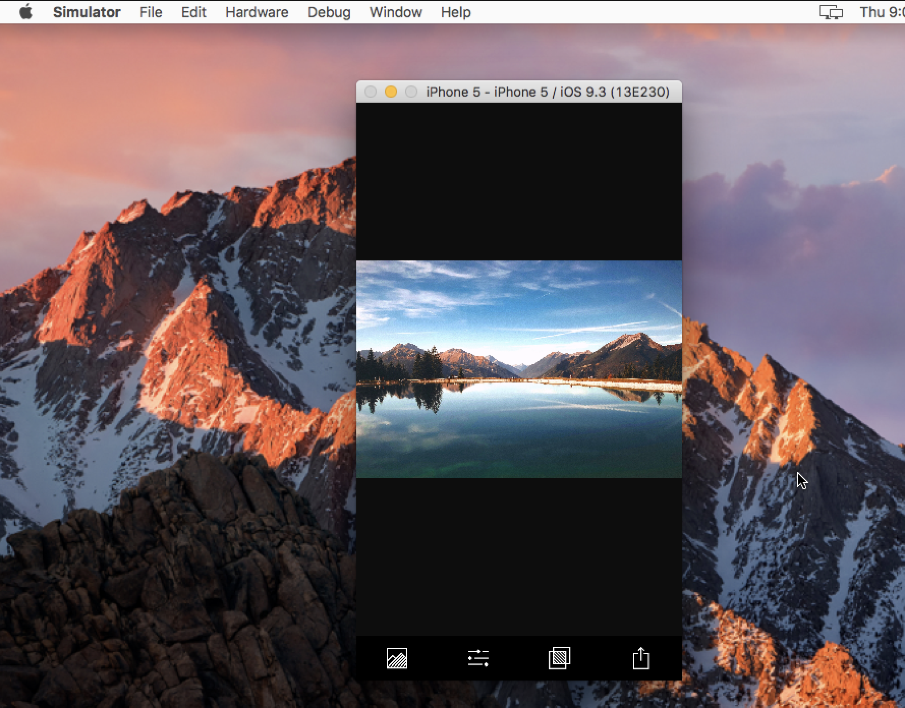
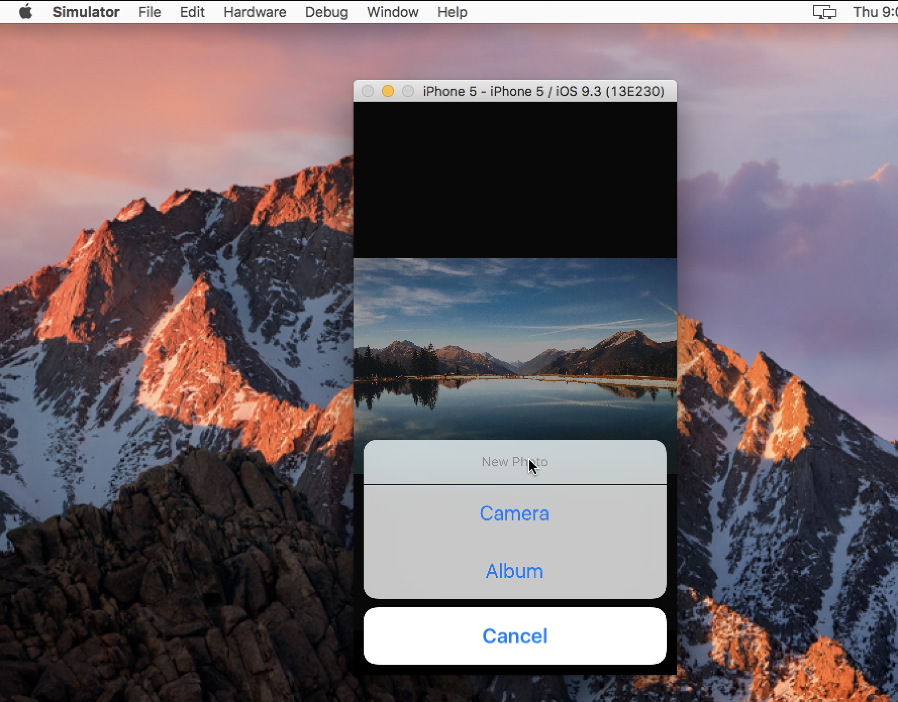
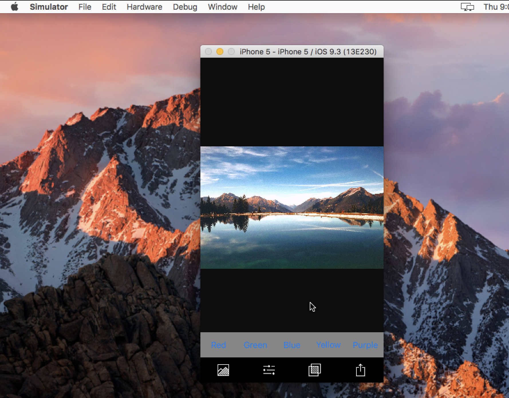
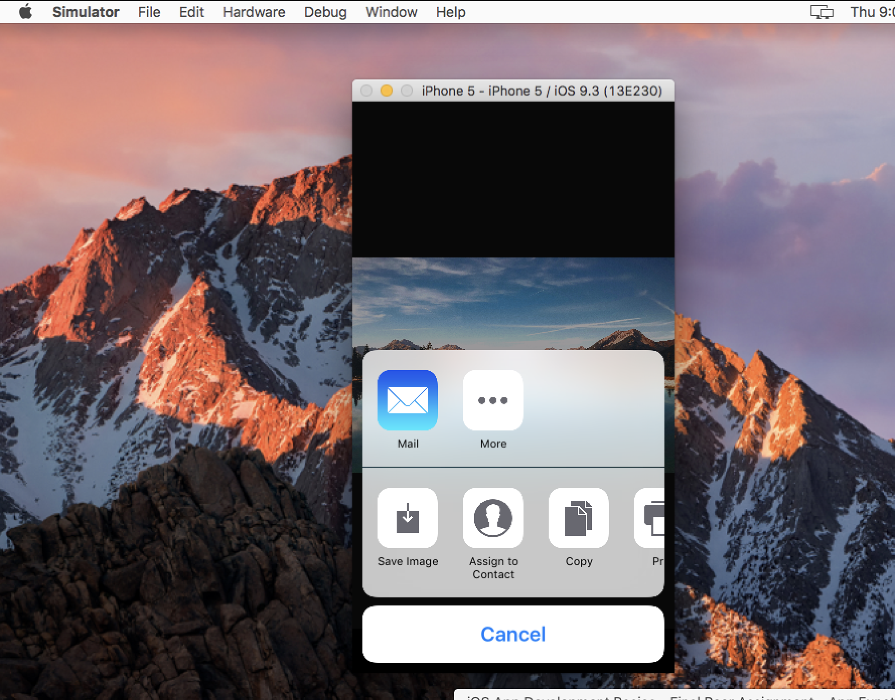

# Filter App   

## App Preview

Feel free to Star or Fork it and make your changes , then make pull request.

We will appreciate your Changes and Review it 😄

	 
	 
	 
	 
	
	
Loading

	 
	 
	 
	 

